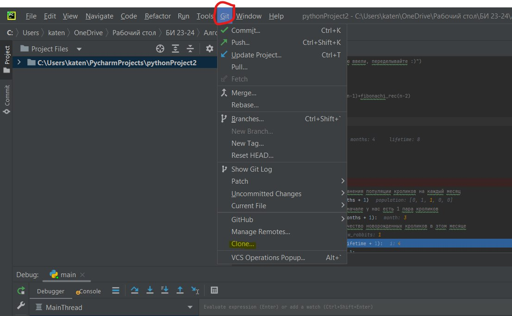
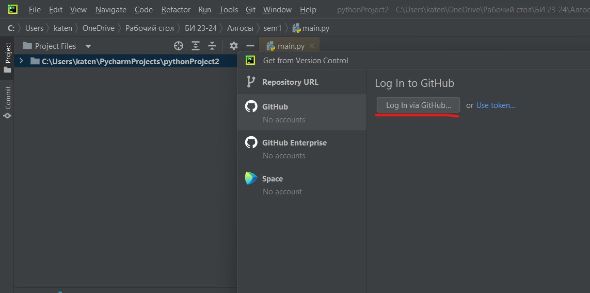
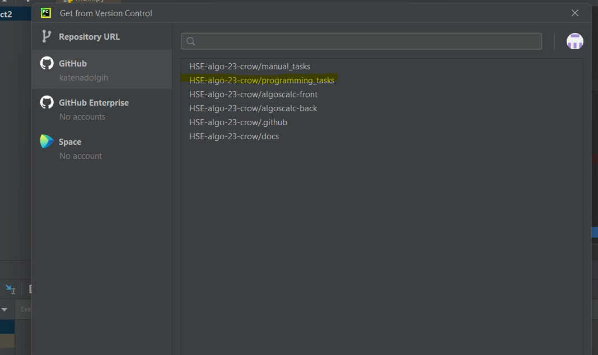
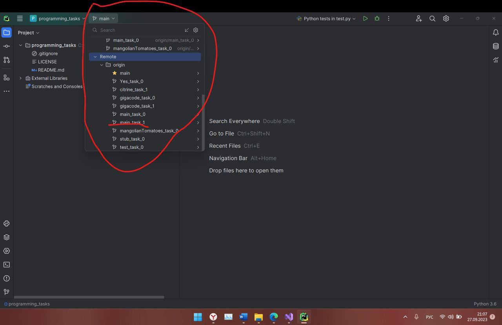
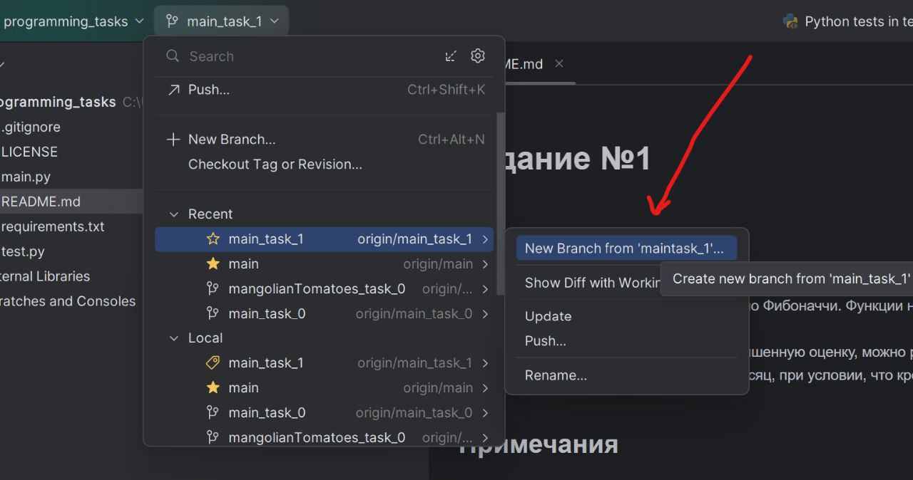
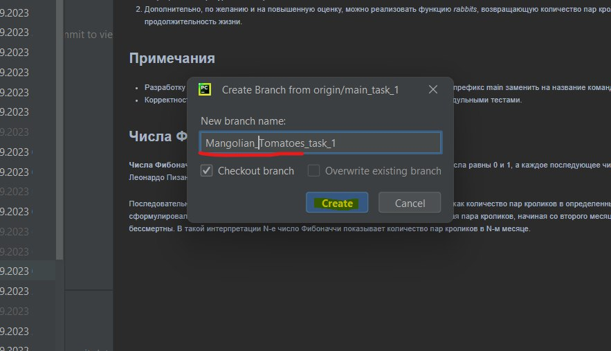
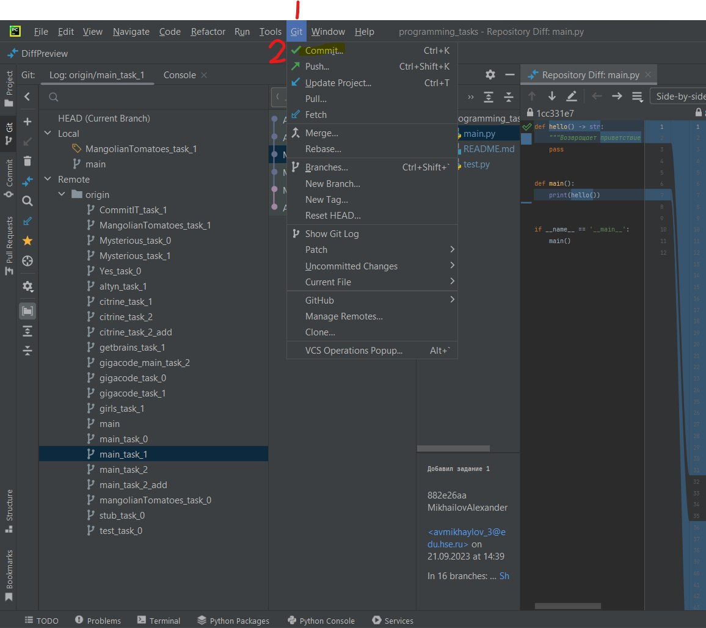
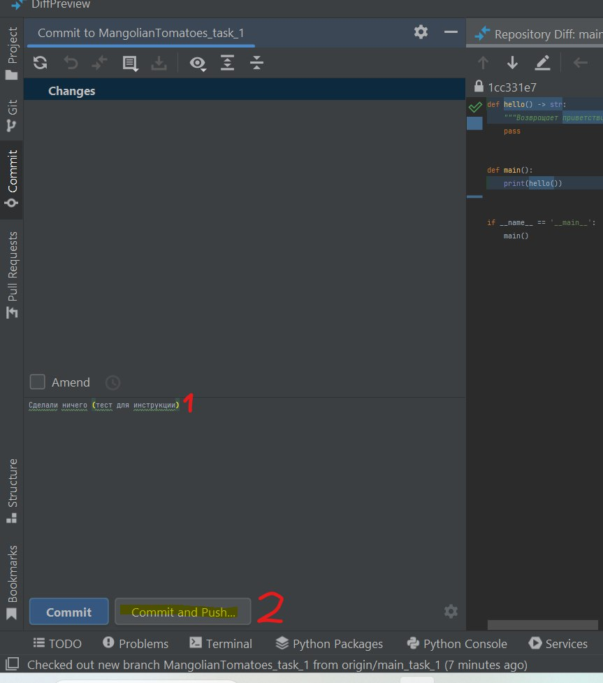
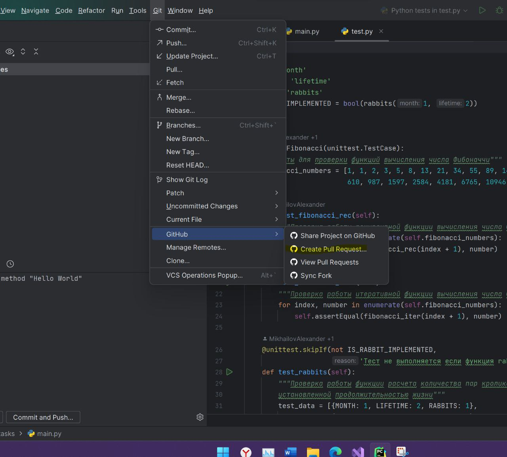
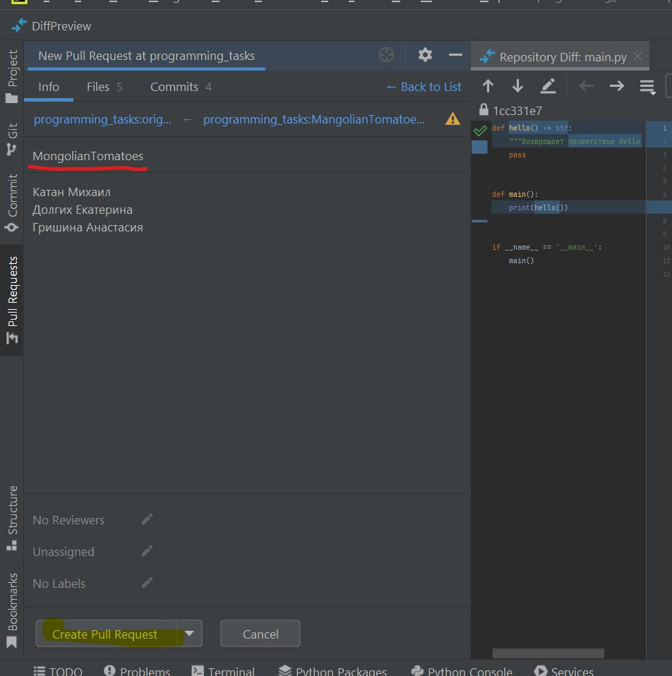

# Загрузка и оформление заданий на GitHub
После установки IDE Pycharm и настройки в IDE учетной записи GitHub необходимо клонировать репозитории учебной программы. 

### Если вы не подключили GitHub к PyCharm, то войдите в аккуант по второй кладке 

Далее в списке репозиториев необходимо выбрать **"Programming_tasks"**.

### Создание новой ветки
После клонирования переходим в **"Programming_tasks"** и в разделе **"Remove"** выбираем **Main** с нужным вам заданием.

#### Обязательно создаем новую ветку!

#### Название ветки: название группы и номер задания

Далее спокойно выполняйте задание в **Main.py** и прозодите все тесты
### Commit, push and pull request
После успешного выполнения задания перейдите во вклыдку **Git** и выберите **Commit**.

Обязательно напишите какие изменения вы произвели и нажмите **Commit and Push**.

Далее во вкладке **GitHib** выбираем **Create Pull Request**.

В названии указываем название вашей команды, а в описании указываем всех участников, работавших над заданием. Нажимаем **Create Pull Request**.

### Поздравляем! Вы успешно загрузили задание на GitHub

