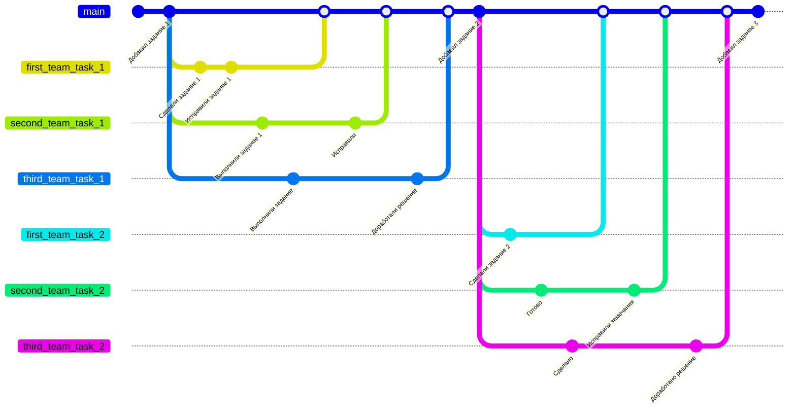
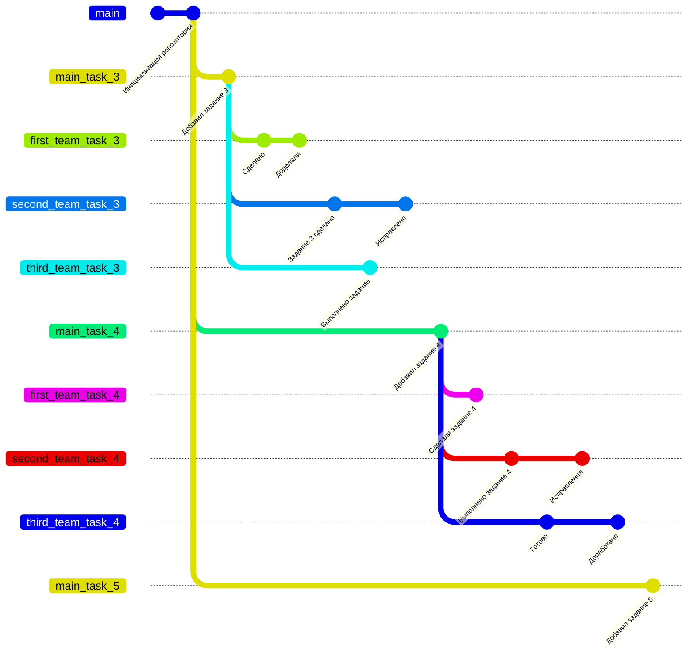
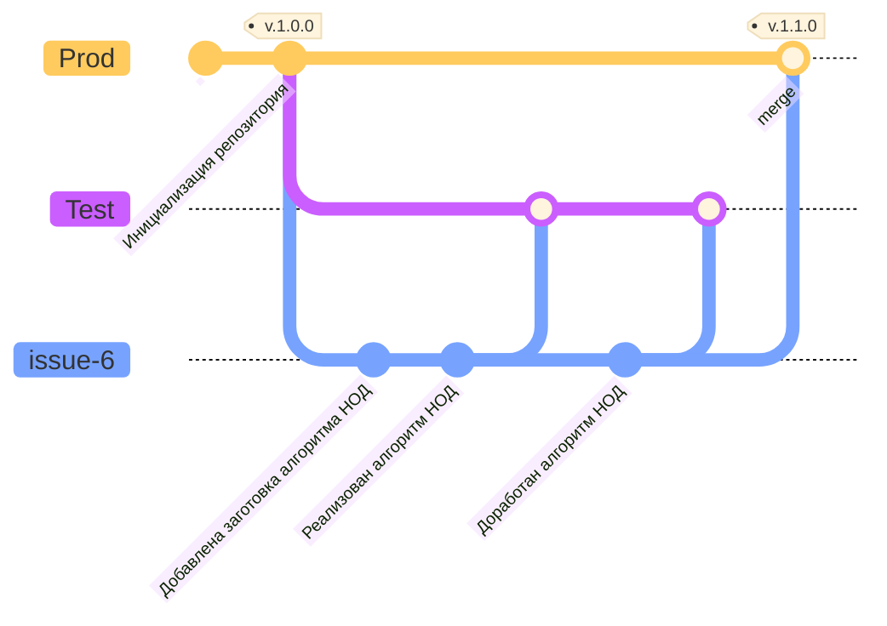

---
Структура ветвления репозитория с ручными заданиями
--- 

Задания размещаются в основной ветке с названием main. Для выполнения задания команда студентов создает отдельную ветку на основе ветки main. В отдельной ветке студенты добавляют решение задания и создают запрос на внесение изменений с решением в ветку main. Преподаватель проверяет открытые запросы на внесение изменений, при наличии замечаний оставляет комментарии к запросу, а при отсутствии замечаний одобряет запрос и вливает предложенные изменения в основную ветку.

---
Структура ветвления репозитория с программными заданиями
--- 

В основной ветке репозитория с названием main размещена общая информация о выполнении заданий по программированию. Сами задания размещаются в отдельных ветках с префиксом main в названии, например main_task_3.  Ветки с префиксом main являются защищенными и студенты не могут вносить изменения непосредственно в этих ветках. Для выполнения задания команда студентов создает отдельную ветку на основе ветки с решаемым заданием, например main_task_3. В этой ветке студенты добавляют решение задания и создают запрос на внесение изменений с решением в ветку с решаемым заданием. При открытии запроса на внесение изменений выполняются автотесты, проверяющие программный код, написанный студентами. Информация о прохождении тестов автоматически добавляется к запросу. Преподаватель проверяет открытые запросы на внесение изменений, при наличии замечаний оставляет комментарии к запросу, а при отсутствии замечаний принимает выполненное задание и закрывает запрос без вливания предложенных изменений в ветку.

---
Структура ветвления репозитория с web-приложением
--- 

В репозитории с исходным кодом web-приложения имеются защищенные ветки с названиями Prod и Test, на основе которых обновляются продуктовый и тестовый стенды web-приложения. Заготовка для задания создается в ветке, основанной на ветке Prod, в этой ветке студенты выполняют задание и создают запрос на внесение изменений в ветку Test. При создании запроса выполняются автоматические проверки, после чего изменения проверяются преподавателем и при отсутствии замечаний вливаются в ветку Test. После обновления ветки обновляется тестовый стенд web-приложения, на котором можно проверить доработки. После проверки на тестовом стенде ветка с решенным заданием вливается в ветку Prod и после указания очередной версии обновляется продуктовый стенд web-приложения.

