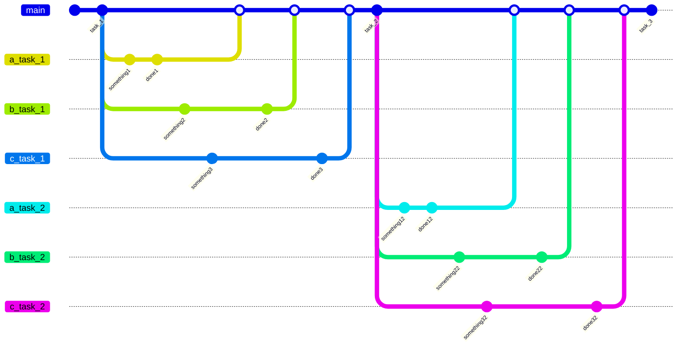
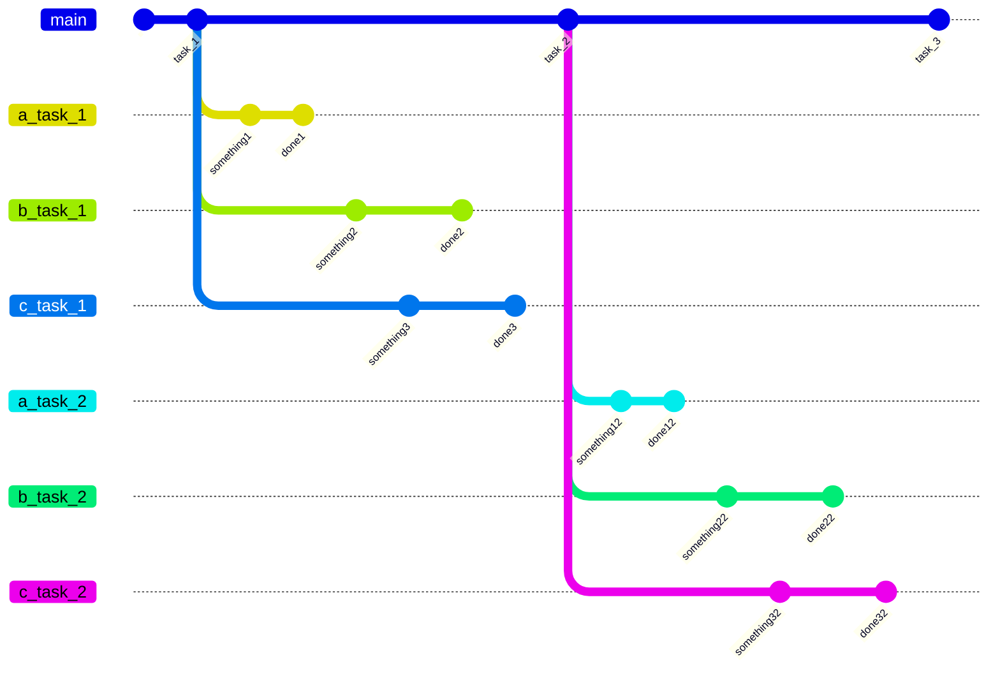

---
Структура ветвления репозитория с ручными заданиями
--- 

Во время работы с ручными заданиями, происходит ветвление на множество команд, которые после вливаются в главную

---
Структура ветвления репозитория с программными заданиями
--- 

Во время работы с программными заданиями, происходит ветвление на множество команд, без последующего вливания

